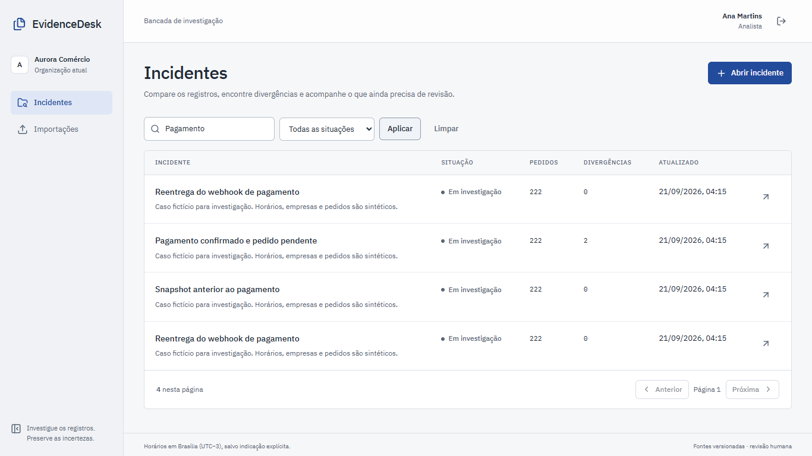
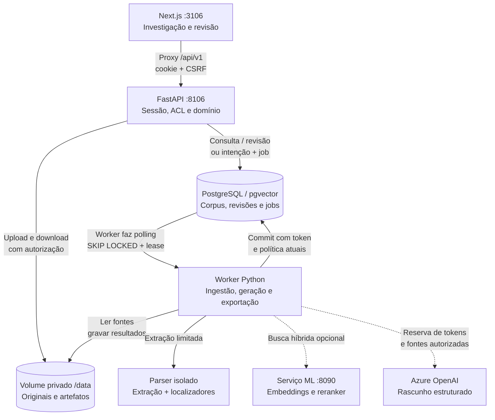
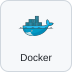

# EvidenceDesk

Investigação de pedidos com fontes verificáveis e revisão por outra pessoa.

<!-- Navegação do README -->
<p>
  <a href="#demonstração"></a>
  <a href="#arquitetura"></a>
  <a href="#executar-localmente"></a>
  <a href="#verificação-e-evidências"></a>
  <a href="https://www.linkedin.com/in/arthur-joanes-6a2967373/"></a>
</p>

## Visão geral

Desenvolvi o EvidenceDesk para investigar casos em que o pagamento foi confirmado, mas o pedido continua pendente. A aplicação reúne eventos, snapshots e documentos; separa [regras determinísticas](backend/src/evidencedesk/reconciliation/rules.py) de rascunhos opcionais de IA e exige outra conta para aprovar uma revisão. É uma demonstração sintética, sem adoção comercial ou ganho de produtividade medido.

<a id="na-prática"></a>
<a id="uma-investigação-do-início-ao-fim"></a>

## Demonstração



_Página principal do EvidenceDesk. Os registros abaixo identificam os cenários e resultados demonstrados._


O recorte mostra **duas divergências do mesmo pedido**, entre **222 pedidos** do snapshot sintético. Duas divergências não significam dois pedidos afetados. A jornada registrada em **22/09/2026, 12:34 UTC** conferiu fontes, criou um dossiê, aprovou com outra conta e exportou a revisão. [Prova da jornada](docs/evidence/editorial-payment-20260922/payment-story.json) · [origem da captura](docs/evidence/screenshots-20260922.json).

No caso `PED-009-000`, as [regras](backend/src/evidencedesk/reconciliation/rules.py) apontam incompatibilidade entre pagamento e snapshot e uma transição não observada dentro da cobertura. Elas não identificam a causa nem corrigem o sistema de origem.

1. Importe fontes e confira a cobertura do snapshot.
2. Investigue divergências, linha do tempo e originais.
3. Edite o dossiê ou solicite um rascunho opcional de IA.
4. Submeta a revisão para outra conta.
5. Exporte a versão aprovada com as fontes da decisão.

Na jornada registrada acima, a [consulta independente ao banco](docs/evidence/editorial-payment-20260922/provider-check.json) mostrou **zero chamadas ao provedor** antes e depois da execução. O [teste da jornada](frontend/e2e/payment-story.spec.ts) cobre esse percurso. A operação de contas distintas verifica o fluxo, sem constituir avaliação por participantes humanos.

<a id="implementação"></a>
<a id="arquitetura-e-escolhas"></a>

## Arquitetura

O EvidenceDesk é um **monólito modular com dois processos de backend**: a API atende consultas e admite operações; o worker executa os trabalhos demorados. O desenho mostra o perfil local do [Compose](infra/compose/compose.yaml). O banco concentra domínio, fila e orçamento; os módulos internos e as transações estão detalhados no guia.



Setas contínuas representam o caminho local; pontilhadas, integrações opcionais. O progresso passa pela API e pelo proxy, sem conexão direta do navegador ao banco. O worker compartilha código, banco e volumes com a API; os módulos de domínio não são microsserviços independentes.

| Fronteira | O que acontece nela | Implementação |
| --- | --- | --- |
| Navegador → API | O proxy preserva sessão e streaming; o backend confere CSRF e acesso ao recorte. | [Proxy](frontend/src/app/api/v1/%5B...path%5D/route.ts), [identidade](backend/src/evidencedesk/identity/service.py) |
| HTTP → fila | Finalizar importação, pedir geração ou exportar grava a intenção e o job antes de responder. | [Ingestão](backend/src/evidencedesk/ingestion/routes.py), [jobs](backend/src/evidencedesk/jobs/service.py) |
| Worker → publicação | Parsing e rede ocorrem fora da transação; o commit revalida lease, token de execução e política. | [Dispatcher](backend/src/evidencedesk/worker.py), [processamento](backend/src/evidencedesk/ingestion/processing.py) |
| Fontes → decisão | O snapshot fixa o corpus; regras calculam divergências, e uma revisão imutável exige decisão de outra conta. | [Conciliação](backend/src/evidencedesk/reconciliation/rules.py), [revisões](backend/src/evidencedesk/reviews/service.py) |
| Aplicação → IA | Busca lexical funciona sem ML; geração recebe fontes delimitadas e não aprova nem altera pedidos. | [Ferramentas de leitura](backend/src/evidencedesk/investigations/tools.py), [admissão de tokens](backend/src/evidencedesk/investigations/budget.py) |

**Percurso principal:** manifesto e upload → extração → snapshot → incidente e conciliação → dossiê manual ou rascunho opcional → revisão por outra conta → exportação HTML autorizada. A interface acompanha geração por eventos SSE persistidos, retomáveis com `Last-Event-ID`.

No perfil local, `db_data`, `evidence_data` e `deletion_ledger` são volumes distintos no mesmo host. O adaptador Blob e a infraestrutura Azure têm bloqueadores de implantação próprios. A [arquitetura detalhada](docs/architecture.md) descreve contratos entre módulos, sequência de importação, modelo de dados, falhas e observabilidade.

<a id="o-que-eu-implementei"></a>
<a id="stack"></a>

## Stack e decisões

<p>
  
  
  
  
  
  
  
</p>

| Componente                          | Papel e compromisso                                                                    |
| ----------------------------------- | -------------------------------------------------------------------------------------- |
| Python e FastAPI                    | Domínio, autorização, importação e operações assíncronas                               |
| PostgreSQL/pgvector                 | Dados, fila, isolamento e recuperação; o mesmo banco concentra essas responsabilidades |
| TypeScript, React e Next.js         | Interface para investigar, editar, revisar e exportar                                  |
| Docker Compose                      | Operação local com volumes próprios                                                    |
| Azure OpenAI, embeddings e reranker | Perfis opcionais; o fluxo manual e lexical não depende de geração                      |

As versões estão fixadas nas dependências do [backend](backend/pyproject.toml), do [frontend](frontend/package.json) e no [Compose](infra/compose/compose.yaml). O nome do deployment Azure é configuração do operador; não prova a identidade ou versão do modelo, conforme o [contrato da integração](backend/src/evidencedesk/model_runtime/azure.py) e a [documentação Microsoft](https://learn.microsoft.com/en-us/azure/foundry/foundry-models/concepts/endpoints).

Conciliação, revisão e geração têm responsabilidades separadas: uma citação válida estruturalmente ainda precisa sustentar o texto. O candidato treinado permanece sem promoção e sem adjudicação humana. O [model card](docs/model-card.md) reúne o protocolo, as medições e os limites dessa avaliação.

<a id="executar-e-verificar"></a>
<a id="rodar-localmente"></a>

## Executar localmente

Use Docker com containers Linux, Compose **2.24.4+** e Python **3.11+** para a CLI do host. Os overlays usam [`!override`](infra/compose/integration.yaml), que requer essa [versão do Compose](https://docs.docker.com/reference/compose-file/merge/#replace-value). O build baixa dependências; a geração Azure exige configuração própria e pode ter cobrança do provedor.

```powershell
python scripts/ops.py config
python scripts/ops.py build
python scripts/ops.py start
python scripts/ops.py seed
```

Abra [localhost:3106](http://127.0.0.1:3106). Use `ana@aurora.demo` para investigar ou `bruno@aurora.demo` para revisar, com a senha pública da demonstração `EvidenceDesk-demo-2026!`. As contas do [seed](backend/src/evidencedesk/seed.py) são sintéticas e os serviços ficam publicados em loopback.

```powershell
python scripts/ops.py stop
```

`stop` preserva os volumes. O [runbook local](docs/runbooks/local.md) detalha instalação, Azure opcional e diagnóstico.

<a id="verificar-e-explorar"></a>

## Verificação e evidências

| Evidência                                                                                                        | Data e alcance                                                        |
| ---------------------------------------------------------------------------------------------------------------- | --------------------------------------------------------------------- |
| [Jornada de pagamento](docs/evidence/editorial-payment-20260922/payment-story.json)                              | 22/09/2026; UI/API reais, dados sintéticos e nenhuma avaliação humana |
| [Chamadas ao provedor](docs/evidence/editorial-payment-20260922/provider-check.json)                             | 22/09/2026; contagem no banco antes e depois da jornada manual        |
| [Reabertura após restauração](docs/evidence/restore-read-story/20260922T072246Z-492911fe/restore-execution.json) | 22/09/2026; execução histórica com identidade própria                 |
| [Scan da rodada editorial](docs/evidence/editorial-payment-security-20260922/summary.json)                       | 22/09/2026; imagens e base do scanner identificadas no registro       |

Esses registros sustentam as execuções identificadas, não um novo teste deste README. A lista de cenários e comandos está em [verificação](docs/verification.md) e [desenvolvimento](docs/development.md).

```powershell
python -m pip install --require-hashes -r scripts/requirements-docs.lock
python scripts/check_repository_docs.py
```

O [checker](scripts/check_repository_docs.py) verifica caminhos e âncoras locais; não certifica conteúdo, sites externos ou qualidade semântica de respostas.

<a id="limites-e-manutenção"></a>
<a id="ia-e-escopo"></a>

## Limites e segurança

[Política de segurança e relato de vulnerabilidades](SECURITY.md) · [Modelo de ameaças](docs/threat-model.md) · [Scans das imagens](docs/publication-security.md).

A aplicação não corrige pedidos nem executa [ferramentas de escrita](backend/src/evidencedesk/investigations/tools.py) nos sistemas de origem. As permissões são verificadas fora do modelo. Uma chamada com resultado desconhecido conserva sua [reserva de tokens](backend/src/evidencedesk/investigations/budget.py); a contabilidade é de tokens, não uma tabela monetária.

O pacote humano reúne **60 casos de desenvolvimento em oito famílias**, marcado `prepared_not_executed`. Não há resultado de adjudicação nesse pacote; referências sintéticas não demonstram qualidade em incidentes reais. [Manifesto do pacote](evals/human-review/package.json), preparado em **22/09/2026**. O conjunto reservado não foi usado nesta revisão.

A infraestrutura Azure permanece **não implantada por este projeto** nos registros disponíveis: a [validação local](docs/evidence/azure-iac-validation.json) de `fmt`, `init` e `validate` não comprova quota, SKU, rede ou capacidade regional. O [runbook hospedado](docs/runbooks/azure-hosted.md) detalha os bloqueadores. Scans e testes têm imagem e data próprias; não constituem garantia de ausência de falhas.

## Documentação

[Padrão compartilhado da documentação](docs/padrao-documentacao.md) · [Fontes e afirmações](docs/fontes-e-afirmacoes.md).

| Para consultar               | Documento                                                                                                                                                            |
| ---------------------------- | -------------------------------------------------------------------------------------------------------------------------------------------------------------------- |
| Explorar o produto           | [Demo](docs/demo.md) · [casos e decisões](docs/problem-solution.md)                                                                                                  |
| Implementar e testar         | [Arquitetura](docs/architecture.md) · [API](docs/api-contract.md) · [dados](docs/data-contract.md) · [desenvolvimento](docs/development.md)                          |
| Operar e recuperar           | [Local](docs/runbooks/local.md) · [backup/restore](docs/runbooks/backup-restore.md) · [retenção](docs/runbooks/retention.md)                                         |
| Entender IA e orçamento      | [Model card](docs/model-card.md) · [modelos locais](docs/model-service.md) · [tokens](docs/token-budget.md)                                                          |
| Conferir riscos e resultados | [Política de segurança](SECURITY.md) · [threat model](docs/threat-model.md) · [publicação](docs/publication.md) · [fontes e afirmações](docs/fontes-e-afirmacoes.md) |
| Conferir imagens             | [Origem e reprodução](docs/screenshots.md)                                                                                                                           |

## Autor e licença

<p><a href="https://www.linkedin.com/in/arthur-joanes-6a2967373/"> <strong>Arthur Joanes no LinkedIn</strong></a></p>

[Licença MIT](LICENSE). Ícones da stack e LinkedIn: [Devicon, licença MIT](docs/stack/LICENSE.devicon).
