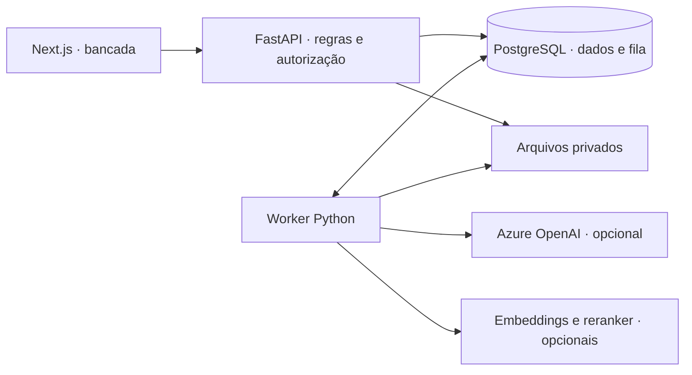

# EvidenceDesk

Investigação de incidentes de pedidos com evidências, IA e revisão humana.

O pagamento foi confirmado, mas o pedido continua pendente. O EvidenceDesk reúne eventos, snapshots e procedimentos para conferir o que aconteceu, registrar uma hipótese com fontes e submetê-la a outro analista. A conciliação calcula as divergências; a IA ajuda a redigir a investigação.


## Uma investigação do início ao fim

1. Importe um pacote de eventos, documentos e snapshots.
2. Abra o incidente e confira divergências, linha do tempo e cobertura das fontes.
3. Escreva um dossiê ou solicite um rascunho à IA, com referências verificáveis.
4. Submeta uma revisão. Outra pessoa compara as alegações e registra a decisão.
5. Exporte a revisão aprovada com suas fontes e os dados da decisão.

O fluxo manual funciona sem conta Azure. A geração é opcional e produz rascunhos sujeitos à revisão.

## Arquitetura e escolhas



- **Monólito modular, API e worker separados.** As regras ficam em módulos por responsabilidade. Trabalhos demorados saem da requisição HTTP; a fila usa o mesmo PostgreSQL, com lease e fencing para impedir publicação por um worker que perdeu o job.
- **Autorização no backend.** RLS separa organizações; permissões de coleção e incidente limitam cada leitura, inclusive as fontes de resultados derivados. O modelo recebe apenas o contexto autorizado.
- **Evidências e revisões imutáveis.** Um snapshot fixa as fontes da investigação. Editar o dossiê cria outra revisão; a aprovação pertence à versão conferida e exige outro usuário.
- **Conciliação separada da geração.** Regras determinísticas calculam divergências. O modelo sintetiza fontes com orçamento limitado. Um resultado externo incerto exige tratamento explícito para evitar repetir uma chamada cobrada.

O armazenamento local compartilhado simplifica a instalação em um host. Operação entre hosts exige persistência remota e recuperação próprias. Veja os [contratos, alternativas e limites da arquitetura](docs/architecture.md).

## Rodar localmente

Requisitos: **Docker com Linux containers, Compose 2.24.4+ e Python 3.11+**. Na raiz do repositório:

```powershell
python scripts/ops.py config
python scripts/ops.py build
python scripts/ops.py start
python scripts/ops.py seed
```

O primeiro `seed` gera a massa sintética e carrega a demonstração. Abra [localhost:3106](http://127.0.0.1:3106). Entre como `ana@aurora.demo` para investigar ou `bruno@aurora.demo` para revisar. A senha de demonstração é `EvidenceDesk-demo-2026!`.

As contas e os dados são fictícios; os serviços são publicados apenas em loopback. `python scripts/ops.py stop` encerra o projeto preservando os volumes. [Configuração, Azure opcional e solução de problemas](docs/runbooks/local.md).

## Verificar e explorar

Os testes exercitam isolamento entre organizações, permissões de fontes, concorrência, perda de lease, edição de revisões, retenção e restauração. As jornadas no navegador incluem importação, leitura, aprovação e exportação. A [verificação da versão](docs/publication.md) registra os comandos, resultados e limites.

```powershell
python scripts/check_repository_docs.py
```

Para a suíte completa, veja o [guia de desenvolvimento e testes](docs/development.md). Para apresentar o produto, siga a [demonstração de cinco minutos](docs/demo.md).

## IA e escopo

A integração com Azure OpenAI já foi exercitada com uma geração real e reabertura do resultado após reinício. Embeddings, reranker e um experimento supervisionado usam dados sintéticos; seus [resultados e protocolo](experiments/README.md) estão versionados. O candidato treinado permanece separado do modelo ativo até cumprir os critérios de avaliação.

Citações estruturadas permitem conferir uma resposta, mas a qualidade semântica ainda exige avaliação humana. A aplicação completa roda localmente; a infraestrutura Azure é um perfil em desenvolvimento. O [model card](docs/model-card.md) e a [avaliação de segurança](docs/publication-security.md) detalham essas condições.

O perfil opcional de ML aplica uma [correção verificável no carregamento de checkpoints](docs/ml-checkpoint-security.md): shards devem ser arquivos regulares dentro da pasta do checkpoint. O build executa 15 regressões locais; isso não substitui a avaliação de segurança das demais dependências da imagem.

Python · FastAPI · PostgreSQL/pgvector · Next.js · TypeScript · Docker. [Licença MIT](LICENSE).
