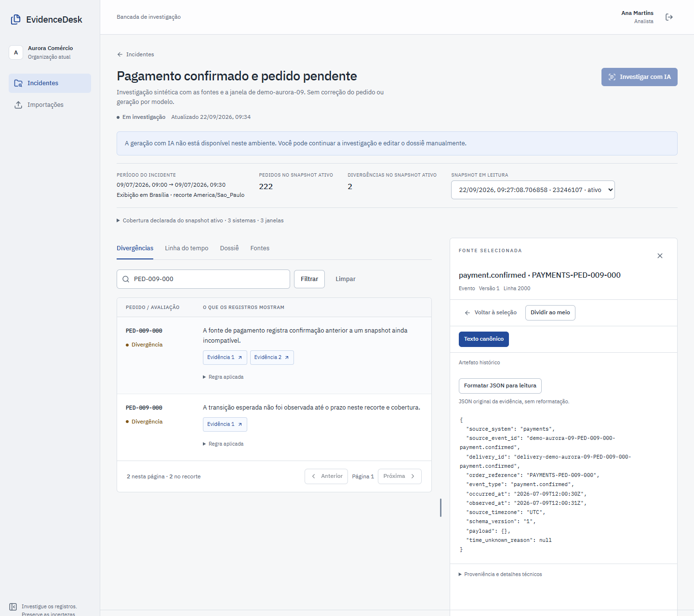
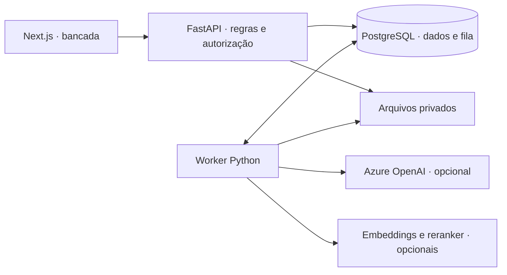

# EvidenceDesk

Investigação de pedidos com fontes verificáveis e revisão por outra pessoa.

Desenvolvi o EvidenceDesk para reunir o material que um analista precisa quando o pagamento foi confirmado, mas o pedido continua pendente. Eventos, snapshots — fotografias do estado de outro sistema — e procedimentos sustentam uma investigação com fontes e revisão. É uma aplicação de portfólio com demonstração sintética, sem adoção comercial ou ganho de produtividade medido.



*Execução local de 22/09/2026, com dados sintéticos: o mesmo pedido aparece em duas verificações, entre 222 pedidos do recorte. Duas divergências não significam dois pedidos afetados. [Abrir a imagem](docs/images/payment-story-20260922/01-pagamento-e-divergencias.png) · [Conferir snapshot, dossiê e revisão da mesma investigação](docs/demo.md).*

**Entrada → resultado:** no pedido sintético `PED-009-000`, o pagamento ocorreu às **12:00:30 UTC** e o snapshot das **12:10:00 UTC** ainda informa `pending_payment`. As regras apontam a incompatibilidade e a confirmação não observada no prazo de 300 segundos. Elas não identificam a causa, não reenviam o pagamento e não corrigem o pedido.

## Uma investigação do início ao fim

1. Importe um pacote de eventos, documentos e snapshots.
2. Abra o incidente e confira divergências, linha do tempo e cobertura das fontes.
3. Escreva um dossiê ou solicite um rascunho à IA, com referências verificáveis.
4. Submeta uma revisão. Outra pessoa compara as alegações e registra a decisão.
5. Exporte a revisão aprovada com suas fontes e os dados da decisão.

O fluxo manual funciona sem conta Azure. A geração é opcional e produz rascunhos sujeitos à revisão.

## O que eu implementei

- **Importação com proveniência:** valido manifesto, tamanho e hash; preservo texto canônico, localizadores e a composição de cada snapshot. O original continua acessível conforme a permissão atual.
- **Conciliação independente da IA:** separei eventos lógicos de reentregas e comparei ocorrência, estado, mapeamento e cobertura em regras testáveis. A ausência de coleta impede conclusões que os dados não sustentam.
- **Autorização sobre fontes e resultados:** combinei isolamento por organização com permissões de coleção e incidente, inclusive para dossiês, ferramentas e conciliações derivadas.
- **Edição e revisão:** implementei versões que não sobrescrevem as anteriores, conflito explícito de gravação, revisão por outra conta e exportação da versão aprovada.
- **Execução assíncrona e recuperação:** implementei admissão, lease, publicação protegida contra workers atrasados e reaplicação de exclusões após restore. Configurei observabilidade e integrei serviços opcionais de modelos; não desenvolvi essas ferramentas de terceiros.

O [guia de casos](docs/problem-solution.md) relaciona cada comportamento ao código, aos testes e ao custo da escolha. As justificativas descrevem a implementação atual; não são relatos de incidentes de clientes.

Dois exemplos distinguem o trabalho feito: um pagamento anterior a um snapshot ainda pendente pode gerar uma divergência; duas entregas do mesmo evento lógico contam como duas observações, não como dois pagamentos. A conclusão conserva o recorte, a cobertura e as fontes usadas. O [guia de problemas, exemplos e decisões](docs/problem-solution.md) liga esses casos às regras e aos testes, incluindo permissões revogadas, edição concorrente, custo incerto de IA e retenção.

## Arquitetura e escolhas



- **Monólito modular, API e worker separados.** As regras ficam em módulos por responsabilidade. Trabalhos demorados saem da requisição HTTP; a fila usa o mesmo PostgreSQL. Um prazo de posse (*lease*) e a validação da identidade de execução (*fencing*) impedem que um worker publique depois de perder o trabalho.
- **Autorização no backend.** Políticas de acesso por linha no PostgreSQL (RLS) separam organizações; permissões de coleção e incidente limitam cada leitura, inclusive as fontes de resultados derivados. O modelo recebe apenas o contexto autorizado.
- **Evidências e revisões imutáveis.** Um snapshot fixa as fontes da investigação. Editar o dossiê cria outra revisão; a aprovação pertence à versão conferida e exige outro usuário.
- **Conciliação separada da geração.** Regras determinísticas calculam divergências. O modelo sintetiza fontes com orçamento limitado. Um resultado externo incerto exige tratamento explícito para evitar repetir uma chamada cobrada.

O armazenamento local compartilhado simplifica a instalação em um host. Operação entre hosts exige persistência remota e recuperação próprias. Veja os [contratos, alternativas e limites da arquitetura](docs/architecture.md).

## Rodar localmente

Requisitos: **Docker com Linux containers, Compose 2.24.4+ e Python 3.11+**. Na raiz do repositório:

```powershell
python scripts/ops.py config
python scripts/ops.py build
python scripts/ops.py start
python scripts/ops.py seed
```

O primeiro `seed` gera a massa sintética e carrega a demonstração. Abra [localhost:3106](http://127.0.0.1:3106). Entre como `ana@aurora.demo` para investigar ou `bruno@aurora.demo` para revisar. A senha de demonstração é `EvidenceDesk-demo-2026!`.

As contas e os dados são fictícios; os serviços são publicados apenas em loopback. `python scripts/ops.py stop` encerra o projeto preservando os volumes. [Configuração, Azure opcional e solução de problemas](docs/runbooks/local.md).

## Verificar e explorar

Os testes exercitam isolamento entre organizações, permissões de fontes, concorrência, perda de lease, edição de revisões, retenção e restauração. As jornadas no navegador incluem importação, leitura, aprovação e exportação. A [verificação da versão](docs/publication.md) registra os comandos, resultados e limites.

A [nova jornada manual](docs/evidence/editorial-payment-20260922/payment-story.json) conferiu os dois originais por tamanho e SHA-256, criou o dossiê pela interface, verificou a decisão de outra conta e exportou a revisão. A conciliação permaneceu igual depois da aprovação e o banco registrou zero chamadas ao provedor. O teste automatiza as contas; não é uma avaliação humana da conclusão.

```powershell
python scripts/check_repository_docs.py
```

A [história de revisão e recuperação](docs/restore-read-story.md) reúne capturas de aprovação com fonte, conflito que preserva rascunho e reabertura após exclusão. Na execução local de 22/09, o destino manteve a fonte/original/dossiê excluídos inacessíveis, conferiu 108 referências remanescentes e fez zero chamadas ao provedor. A aprovação por contas distintas foi automatizada; não é avaliação humana da qualidade.

Para a suíte completa, veja o [guia de desenvolvimento e testes](docs/development.md). Para apresentar o produto, siga a [demonstração de cinco minutos](docs/demo.md).

## IA e escopo

A integração com Azure OpenAI já foi exercitada com uma geração real e reabertura do resultado após reinício. Embeddings, reranker e um experimento supervisionado usam dados sintéticos; seus [resultados e protocolo](experiments/README.md) estão versionados. O candidato treinado permanece separado do modelo ativo até cumprir os critérios de avaliação.

Citações estruturadas permitem conferir uma resposta, mas a qualidade semântica ainda exige avaliação humana. O [pacote preparado para revisão](evals/human-review/README.md) reúne 60 casos sintéticos de desenvolvimento em oito famílias, rubrica e formulários. Ainda não houve participantes ou adjudicação nesse pacote; o conjunto reservado não foi aberto. A aplicação completa roda localmente; a infraestrutura Azure é um perfil em desenvolvimento. O [model card](docs/model-card.md) e a [avaliação de segurança](docs/publication-security.md) detalham essas condições.

O perfil opcional de ML aplica uma [correção verificável no carregamento de checkpoints](docs/ml-checkpoint-security.md): shards devem ser arquivos regulares dentro da pasta do checkpoint. O build executa 15 regressões locais; isso não substitui a avaliação de segurança das demais dependências da imagem.

Python · FastAPI · PostgreSQL/pgvector · Next.js · TypeScript · Docker. [Licença MIT](LICENSE).
