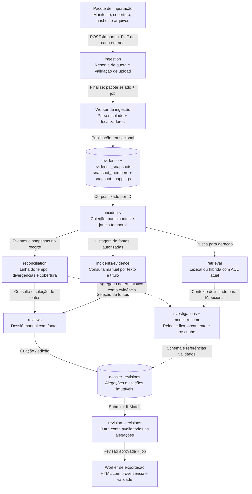
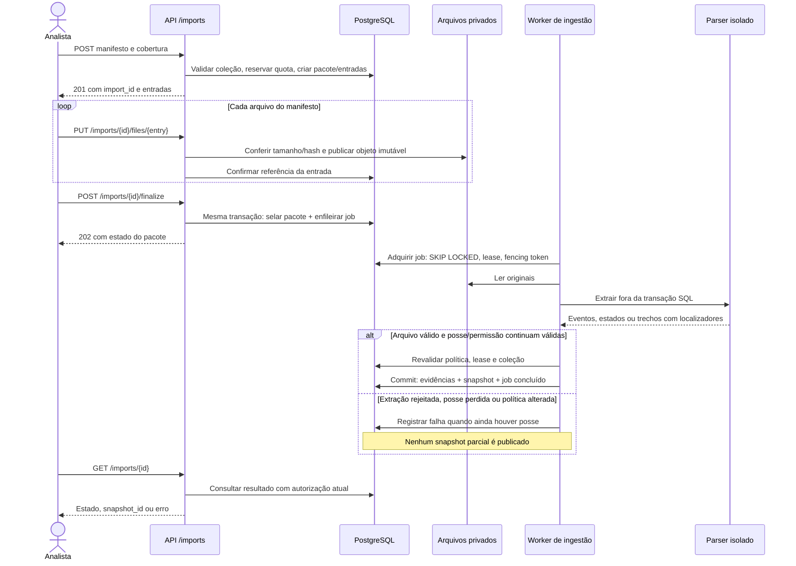
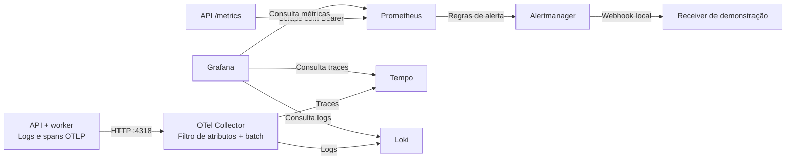

# Arquitetura

Desenvolvi o EvidenceDesk para investigar pedidos com divergências entre pagamento, estoque e entrega. Preservei as fontes usadas e separei a conciliação determinística da elaboração do dossiê. A IA pode propor um rascunho com citações; uma pessoa diferente do autor e do responsável pela submissão decide sobre a revisão.

Organizei a implementação como um monólito modular, com API e workers em processos separados. Essa separação retira extração e inferência da requisição HTTP, mantendo autorização e publicação na mesma base de código. O perfil de demonstração roda em Docker local; Azure OpenAI é uma integração opcional. O estado das verificações e os limites de entrega estão em [verification.md](verification.md).

Para partir de situações concretas antes dos contratos, veja [problemas, exemplos e decisões](problem-solution.md). O guia explica por que reentrega não significa cobrança duplicada, como uma edição concorre com outra e por que uma tentativa de IA incerta conserva sua reserva.

## Componentes e fluxo

O [mapa de processos do README](../README.md#arquitetura) mostra containers e suas conexões. Aqui, o recorte é a transformação das fontes em uma decisão revisável. Cada caixa abaixo é um módulo ou registro da aplicação; o fluxo atravessa API e worker sem criar um serviço de rede para cada etapa.

### Processos, portas e armazenamento

| Unidade de execução | Interface e responsabilidade | Estado / dependência |
| --- | --- | --- |
| `frontend` | Next.js em `:3106`; telas por funcionalidade e proxy de `/api/v1/*`, incluindo upload e SSE. | `API_INTERNAL_URL=http://api:8106`; sem conexão SQL nem credencial de IA. |
| `api` | FastAPI em `:8106`; sessão, ACL, consultas, conciliação, revisão e admissão de jobs. | Role `ed_app`, contexto de tenant por transação, `/data` e `/ledger`. |
| `worker` | Processo Python sem porta HTTP; polling dos tenants habilitados e despacho de `ingestion`, `investigation`, `export`, `purge` e `index_snapshot`. | Mesmo código/role/volumes da API; heartbeat renova o lease durante a execução. |
| `db` | PostgreSQL com pgvector em `:5432`; RLS, domínio, fila e orçamento persistido. | Volume `db_data`; porta do host `127.0.0.1:5546`. |
| `migrate` | Job de inicialização: `alembic upgrade head`, após o banco ficar saudável. | Role `ed_owner`; API e worker só iniciam após sucesso. |
| Armazenamento privado | `evidence_data` em `/data`: uploads e artefatos; `deletion_ledger` em `/ledger`: exclusões duráveis. | API e worker compartilham os volumes; não há URL pública de objeto no fluxo local. |
| `models` — perfil `ml` | HTTP privado em `:8090`, token de serviço, E5 e reranker; pesos pré-carregados em `/models`, montado somente para leitura. | Container próprio com GPU; o Compose básico não o inicia. |
| Azure OpenAI — opcional | Responses chamado pelo worker com orçamento e fontes já autorizados. | Endpoint/deployment/credencial externos; não participa do dossiê manual. |

As portas publicadas de frontend e API também ficam em `127.0.0.1`. Essas são as portas padrão; os parâmetros `ED_*_PORT` podem alterá-las. [Compose](../infra/compose/compose.yaml) e [proxy](../frontend/src/app/api/v1/%5B...path%5D/route.ts) são os contratos de execução. O perfil local usa HTTP em loopback e não demonstra terminação TLS, operação entre hosts ou alta disponibilidade.

### Importação: da requisição ao snapshot

O [parser](../backend/src/evidencedesk/ingestion/processing.py) recebe apenas as variáveis de ambiente permitidas, tem timeout de 25 segundos e aplica [limites de extração](../backend/src/evidencedesk/ingestion/limits.py). Um PDF sem texto extraível leva a `requires_ocr`; OCR não é executado. O snapshot novo herda membros e mapeamentos do anterior, acrescenta as entradas válidas e atualiza o snapshot ativo da coleção na mesma transação. No perfil não lexical, essa publicação também agenda `index_snapshot`; a busca vetorial exige o índice completo.

### Investigação, geração e revisão

1. **Fixar o recorte.** O incidente identifica coleção, membros e janela temporal; a execução recebe `evidence_snapshot_id`. A [conciliação](../backend/src/evidencedesk/reconciliation/rules.py) calcula os sinais sobre eventos/estados. A [consulta manual de fontes](../backend/src/evidencedesk/incidents/routes.py) usa busca textual/título; o módulo [retrieval](../backend/src/evidencedesk/retrieval) prepara contexto lexical ou híbrido para o worker de geração. Ambos respeitam a autorização atual. Nenhuma chamada de geração é necessária para consultar fontes ou criar um dossiê manual.
2. **Admitir a geração opcional.** `POST /incidents/{id}/runs` exige `Idempotency-Key`. [create_run](../backend/src/evidencedesk/investigations/service.py) fixa o recorte, a release e os limites e grava a execução e o job na transação da API. O retorno é `202` com `Location`; repetir a chave com conteúdo diferente gera conflito.
3. **Construir e enviar o contexto.** O [worker](../backend/src/evidencedesk/investigations/processing.py) usa ferramentas de leitura, preserva um agregado determinístico da conciliação como evidência e delimita os trechos enviados. Antes da rede, revalida fontes/permissões e persiste a reserva em `provider_calls`; a chamada ao provedor ocorre sem manter uma transação SQL aberta.
4. **Publicar o rascunho.** Uso conhecido é conciliado no orçamento. A resposta deve passar pelo schema e pela validação de referências; a publicação revalida a posse da execução e o acesso às fontes. A API transmite `run_events` por SSE em `/runs/{id}/events`, com retomada por `Last-Event-ID`, reautorização durante o stream e sinalização de ressincronização quando necessário.
5. **Revisar e exportar.** O dossiê guarda revisões imutáveis; edição, submissão e decisão usam revisão de base/`If-Match`. A aprovação pertence à revisão e exige outra conta além do autor e do responsável pela submissão. O [job de exportação](../backend/src/evidencedesk/reviews/exporting.py) grava HTML escapado com fontes e proveniência em `/data`; a referência fica válida por 24 horas, e cada download revalida o acesso.

### Dados persistidos e vínculo de proveniência

| Grupo de registros | Chave ou vínculo relevante | Por que existe |
| --- | --- | --- |
| `tenants`, `users`, `sessions`, `collection_grants`, `incident_members` | Organização, usuário, coleção e incidente | Identidade e acesso atual; uma URL ou um ID conhecido não concede permissão. |
| `import_batches`, `import_entries` | Pacote, entrada, hash e chave privada do arquivo | Acompanhar admissão, upload e extração sem publicar um pacote incompleto. |
| `evidence`, `evidence_snapshots`, `snapshot_members`, `snapshot_mappings` | ID de fonte, snapshot e referência do pedido por sistema | Reconstituir corpus, localizador e correspondência entre origens. |
| `incidents`, `investigation_runs`, `run_events` | Incidente, snapshot, release, execução e sequência de eventos | Preservar o contexto e permitir reabrir o progresso/resultado sem nova geração. |
| `jobs`, `idempotency_keys`, `provider_calls` | Recurso, tipo de operação, chave do cliente e tentativa do provedor | Controlar concorrência, repetição, posse do trabalho e orçamento durável. |
| `dossiers`, `dossier_revisions`, `revision_decisions`, `exports` | Dossiê → revisão → alegações/decisão → arquivo exportado | A aprovação e as fontes pertencem à versão examinada. |
| `audit_events`, `deletion_requests` e ledger em `/ledger` | Ação/recurso e intenção de exclusão | Auditar mutações e reaplicar exclusões posteriores a um backup. |

O [schema inicial](../backend/migrations/versions/0001_foundation.sql) e as [migrações](../backend/migrations/versions) definem as relações; o [contrato de dados](data-contract.md) detalha os tempos e localizadores. pgvector integra o mesmo PostgreSQL, sem banco vetorial separado. Originais e HTML ficam fora das tabelas, que preservam chave privada e hash.

### Falhas e limites de transação

| Interrupção | Resposta da implementação | Limite que permanece |
| --- | --- | --- |
| Arquivo salvo, commit SQL perdido | Objeto sem referência fica para limpeza após período seguro e verificação de produtores ativos. | Arquivo e PostgreSQL não formam uma única transação distribuída. |
| Worker perde lease ou recebe cancelamento | O token de fencing impede o commit do executor antigo. | Ter calculado um resultado não dá direito a publicá-lo. |
| ACL muda durante a execução | O lock/revisão de política e a reautorização bloqueiam publicação com escopo antigo. | Revogação não recupera conteúdo já enviado a um provedor. |
| Resposta do provedor fica desconhecida | Reserva continua comprometida; tentativa despachada não é repetida automaticamente após expiração. | O operador precisa de evidência para conciliar; não se presume custo zero. |
| Duas pessoas editam a mesma base | `If-Match` e a revisão de base recusam a edição obsoleta. | O usuário precisa recarregar e decidir como incorporar a mudança. |
| Restore usa backup anterior a uma exclusão | Ledger atual é reaplicado antes da reabertura controlada. | Volumes separados no mesmo host não resistem à perda completa desse host. |

Os controles estão em [jobs](../backend/src/evidencedesk/jobs/service.py), [storage](../backend/src/evidencedesk/evidence/storage.py), [orçamento](../backend/src/evidencedesk/investigations/budget.py), [revisões](../backend/src/evidencedesk/reviews/service.py) e [retenção](runbooks/retention.md).

### Observabilidade e operação

O [overlay de observabilidade](../infra/compose/observability.yaml) acrescenta um caminho separado do tráfego do produto:

A [configuração do collector](../infra/observability/collector.yaml) conserva atributos permitidos e reduz o corpo dos logs enviados a um evento estruturado. O [Prometheus](../infra/observability/prometheus.yaml) coleta `/metrics` e usa blackbox probes para readiness; as métricas da API também consultam fila e heartbeats persistidos. O `trace_context` acompanha o job para ligar a requisição ao span do worker. Alertas terminam no receiver local deste perfil; esse trajeto não demonstra entrega a uma equipe de plantão.

## Organização do código

O domínio puro de [conciliação](../backend/src/evidencedesk/reconciliation) não conhece banco, autenticação ou modelo. Os módulos de aplicação coordenam persistência e domínio: [ingestão](../backend/src/evidencedesk/ingestion), [incidentes](../backend/src/evidencedesk/incidents), [investigações](../backend/src/evidencedesk/investigations) e [revisões](../backend/src/evidencedesk/reviews). [Identidade](../backend/src/evidencedesk/identity), [jobs](../backend/src/evidencedesk/jobs), [evidências](../backend/src/evidencedesk/evidence) e [retenção](../backend/src/evidencedesk/retention) concentram controles compartilhados.

O frontend se organiza por funcionalidades em [frontend/src/features](../frontend/src/features), com componentes comuns e tokens visuais. O contrato público e seus estados de erro estão em [api-contract.md](api-contract.md).

## Invariantes de segurança e consistência

**Identidade e isolamento.** A aplicação usa uma role sem owner, superuser ou `BYPASSRLS`; migrações usam credencial separada. O contexto de organização é definido por transação. Identificadores iguais em organizações diferentes não concedem acesso. Sessões usam cookie HttpOnly; mutações exigem origem autorizada e token CSRF. O login reserva admissão no banco antes de verificar a senha e limita hashes concorrentes por processo.

**Fontes e derivados.** O snapshot fixa o corpus, mas a autorização continua atual. Originais pertencem à coleção; uma conciliação derivada também exige acesso ao incidente de origem. Uma citação ou leitura de ferramenta em contexto de incidente deve respeitar sua coleção, snapshot e janela operacional. A conciliação de outro incidente não pode substituir a do recorte atual. A exclusão de uma fonte bloqueia seus derivados e downloads.

**Tempo.** `occurred_at`, `observed_at`, `ingested_at` e `as_of` têm significados distintos. Quando o evento não informa ocorrência, a seleção usa observação como fallback; não usa a hora de ingestão para inventar uma ocorrência. Reentregas de um evento lógico não comprovam pagamento duplicado. Cobertura incompleta produz limites explícitos para a conclusão. Veja [data-contract.md](data-contract.md).

**Trabalho assíncrono.** Aquisição usa `SKIP LOCKED`, lease com relógio do banco e fencing crescente. Cancelamento invalida o token do worker. A publicação e a revogação serializam no registro de política do tenant. A ordem de locks é controle de manutenção → política → entidade/job. Parsing, rede e inferência acontecem fora da conexão do banco; a publicação e a exclusão de arquivos locais podem manter um lock curto para coordenar arquivo e referência.

**Arquivos e recuperação.** Um arquivo completo com hash confirmado precede a referência transacional. A publicação local não sobrescreve um objeto imutável existente. Falhas entre arquivo e commit podem produzir órfãos; a limpeza espera um período seguro e verifica referências e produtores ativos. A reserva por entrada é liberada uma vez, após remoção confirmada. O ledger de exclusão é reaplicado na restauração para impedir que um backup recupere dados apagados. Procedimentos: [retenção](runbooks/retention.md) e [backup/restore](runbooks/backup-restore.md).

**Revisão humana.** O autor e quem submeteu a revisão não podem aprová-la. A decisão se refere a IDs de alegações da revisão atual; uma aprovação exige todas as alegações. Texto e citações existentes são preservados na revisão original, e qualquer edição cria outra revisão.

## Limites da integração de IA

O gerador usa Azure OpenAI Responses com `store=false` e `background=false`; o sistema conserva seus próprios resultados e manifestos. Reabrir uma investigação usa esses artefatos e não gera outra resposta. Credenciais ficam em configuração de runtime externa ao repositório.

A release congela modelo, instruções, schemas, perfil de retrieval e limites. As ferramentas recebem identidade e escopo do backend; argumentos do modelo não podem trocar organização, usuário ou snapshot. As chamadas têm limite persistido de quantidade, saída e prazo, inclusive após reconstruir um executor. A configuração atual é conferida novamente antes do despacho: uma release antiga não contorna geração desativada.

A baseline ativa usa busca lexical e a pergunta original. Busca híbrida combina lexical e vetores por RRF; reranking é opcional. Embeddings incompletos bloqueiam o perfil vetorial em vez de produzir uma busca parcial silenciosa. Pesos e candidatos treinados exigem preparação explícita; não há promoção automática.

Tokens conhecidos são contabilizados no mês UTC da chamada. Reservas desconhecidas continuam comprometendo orçamento. Após despacho ao provedor, uma tentativa expirada não é repetida automaticamente, mesmo que já exista contabilização: o resultado pode ter sido perdido antes do commit. A política evita duplicar custo e expõe a falha para decisão explícita. Ver [token-budget.md](token-budget.md).

Schema válido e referência existente não comprovam que a fonte sustenta a frase. A avaliação de suporte, contradição e abstenção requer julgamento humano; resultados sintéticos e testes de integração não substituem esse gate.

## Decisões e tradeoffs

Esta tabela explicita motivos técnicos sustentados pelo código e seus custos atuais. Não documenta uma comparação histórica de alternativas nem presume experiência de produção. Implementei o domínio e os controles da aplicação; PostgreSQL, Next.js, FastAPI, Azure OpenAI e as ferramentas de observabilidade são dependências e integrações de terceiros.

| Decisão                         | Motivo                                                            | Custo ou limite                                                                            |
| ------------------------------- | ----------------------------------------------------------------- | ------------------------------------------------------------------------------------------ |
| Monólito modular                | Mantém autorização, auditoria e transações em uma base de código. | Mudanças exigem atenção às fronteiras entre módulos.                                       |
| PostgreSQL como fila            | Admissão e job são atômicos; dispensa broker adicional.           | A fila compartilha capacidade com consultas e exige medir contenção.                       |
| Lock de política por tenant     | Revogação, quotas e publicação seguem uma ordem comum.            | Mutações da mesma organização serializam; não promete throughput ilimitado.                |
| Arquivos privados locais        | Perfil reproduzível e controle explícito de imutabilidade.        | Réplicas dependem de volume compartilhado; o perfil não oferece HA entre hosts.            |
| Busca vetorial exata autorizada | Filtra ACL e snapshot antes do ranking.                           | Consome mais recursos com corpus grande; índices ANN exigem avaliação própria.             |
| Cache pequeno de resumos        | Reduz recálculo de contagens na fila.                             | Chave inclui tenant, snapshot, janela e revisão de política; autorização nunca é cacheada. |
| Cursor assinado                 | Evita mistura de contexto e paginação por offsets.                | Listagens refletem a ACL atual; não representam uma transação congelada entre páginas.     |
| Revisão separada da geração     | Permite comparar e corrigir hipóteses com fontes.                 | A qualidade final depende do trabalho do revisor.                                          |

## Quando uma solução menor basta

O público pretendido é um analista que precisa cruzar fontes de um incidente e deixar uma conclusão revisável. Isso descreve o uso proposto; o repositório não comprova adoção por uma empresa. Para poucos casos, planilha, consulta SQL e checklist de revisão podem bastar. A estrutura deste projeto passa a fazer sentido quando é necessário conservar o conjunto exato de fontes, controlar acesso aos derivados e impedir que uma edição ou exclusão torne uma decisão antiga silenciosamente enganosa. Não houve comparação de produtividade que prove vantagem sobre esse fluxo menor.

O fluxo manual e a busca lexical formam uma referência reproduzível sem provedor. Embeddings, reranker e geração acrescentam dependências, recursos e avaliação. São opcionais porque a existência de uma citação ou um schema válido não demonstra a qualidade da conclusão. O [pacote semântico](../evals/human-review/README.md) prepara a conferência humana com casos de desenvolvimento; não contém participantes nem resultados novos.

| Dificuldade técnica identificada                         | Escolha e motivo                                            | Custo que permanece                                                           |
| -------------------------------------------------------- | ----------------------------------------------------------- | ----------------------------------------------------------------------------- |
| A permissão pode mudar depois de construir um snapshot   | Revalidar fontes e autorização antes de despacho/publicação | Revogação não desfaz conteúdo já transmitido; publicação precisa ser recusada |
| Uma resposta externa pode se perder depois da cobrança   | Persistir admissão e conservar reserva desconhecida         | Orçamento pode ficar comprometido até haver evidência para conciliar          |
| Um backup antigo contém uma fonte excluída depois        | Aplicar o ledger atual antes de abrir o destino             | O ledger precisa sobreviver independentemente da cópia restaurada             |
| Uma referência existente pode não sustentar uma alegação | Separar validação estrutural e avaliação semântica humana   | Revisão consome tempo; ainda não há resultado humano neste pacote             |

Os [casos e testes](problem-solution.md), a [revisão técnica](ai-review.md) e o [runbook de recuperação](runbooks/backup-restore.md) distinguem dificuldade observada, mecanismo e limite. Essas justificativas vêm do código e dos ensaios; não atribuem ao autor incidentes de clientes ou uma experiência de uso não registrada.

## Perfis e limites de implantação

| Perfil                 | Implementado                                          | Limite                                                                                      |
| ---------------------- | ----------------------------------------------------- | ------------------------------------------------------------------------------------------- |
| Core local             | Frontend, API, PostgreSQL, arquivos e workers         | Defaults de demonstração em loopback; sem alta disponibilidade.                             |
| Core com Azure OpenAI  | Geração real e persistência própria verificadas       | Qualidade semântica e preço monetário dependem de avaliação/configuração adicional.         |
| Observabilidade        | OTel, Prometheus, Loki, Tempo, Grafana e Alertmanager | Ensaios locais não comprovam disponibilidade mensal.                                        |
| Modelos e experimentos | E5, reranker e treino em GPU                          | Setup separado; métricas sintéticas e candidato sem promoção.                               |
| Azure hospedado        | IaC e adaptador Blob preparados                       | Sem rollout validado; identidade, rede, GC e ledger cloud precisam de ensaio ponta a ponta. |

PDFs sem texto recebem `requires_ocr`; extração OCR e tabelas digitalizadas não estão implementadas. Kubernetes/kind, MCP e um LLM gerativo local não fazem parte do runtime entregue. O [runbook local](runbooks/local.md), o [modelo de ameaças](threat-model.md) e a [revisão de arquitetura para publicação](architecture-review-publication.md) descrevem operação, riscos e verificações.

## Reabertura controlada após restauração

A [jornada de recuperação](restore-read-story.md) abre API e frontend em loopback somente depois de aplicar o ledger atual e verificar os objetos, mantendo a origem na mesma janela de manutenção. O destino não inicia worker nem modelos. Login/leitura são acompanhados por comparação de domínio e contagem zero de chamadas ao provedor. Ao concluir, o destino volta à manutenção e seus containers param; só então a manutenção da origem é liberada. O restore padrão continua fechado.

O ledger usa volume separado da cópia de banco/objetos, mas ambos permanecem no mesmo computador. Isso evita retroceder exclusões neste ensaio; não demonstra independência contra perda do host. A API aberta conserva mutações normais: somente a jornada foi restrita à leitura após login. [Procedimento e limites](runbooks/backup-restore.md).
