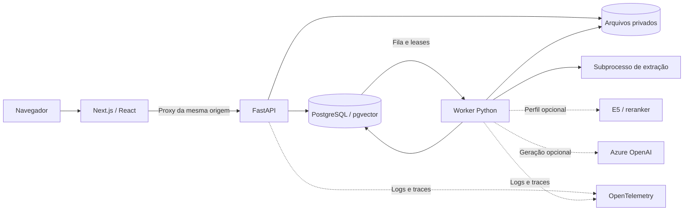

# Arquitetura

O EvidenceDesk investiga pedidos com divergências entre pagamento, estoque e entrega. O sistema preserva as fontes usadas, calcula a conciliação com regras determinísticas e permite que um analista produza um dossiê. A IA pode propor um rascunho com citações; uma pessoa diferente do autor e do responsável pela submissão decide sobre a revisão.

A implementação é um monólito modular, com API e workers em processos separados. O perfil de demonstração roda em Docker local; Azure OpenAI é uma integração opcional. O estado das verificações e os limites de entrega estão em [verification.md](verification.md).

## Componentes e fluxo

| Componente | Responsabilidade | Fronteira |
| --- | --- | --- |
| Frontend | Fila, investigação, leitor, edição e revisão | Apresenta permissões; o backend sempre as valida. |
| API | Sessão, autorização, consulta e admissão de trabalho | Persiste a intenção e o job na mesma transação. |
| PostgreSQL | Conteúdo, snapshots, fila, sessões, quotas e auditoria | RLS por organização, ACL por coleção e associação ao incidente. |
| Worker | Extração, indexação, investigação e exportação | Só publica com lease vigente, fencing e política atual. |
| Armazenamento privado | Originais e artefatos imutáveis | Chaves criadas pelo servidor; acesso mediado pela API. |
| Serviço de modelos | Embeddings E5 e reranker opcionais | Processo privado separado; API e worker não carregam Torch. |
| Azure OpenAI | Rascunho estruturado com fontes | Sem autoridade para aprovar, executar SQL ou remediar pedidos. |

1. **Importar:** validar manifesto e reservar quota; conferir tamanho e SHA-256; fechar o pacote e enfileirar extração. O parser tem prazo e limites de memória/CPU no Linux. A publicação cria um snapshot de evidências.
2. **Investigar:** fixar snapshot e janela do incidente. Regras conciliam eventos e estados; a busca recupera trechos documentais autorizados. O fluxo manual está disponível sem credencial de IA.
3. **Gerar, opcionalmente:** congelar release e limites; executar ferramentas de leitura; reservar orçamento e conferir autorização antes do envio. A resposta estruturada precisa passar pela validação de referências antes de virar rascunho persistido.
4. **Revisar:** salvar uma nova revisão imutável, submeter e obter decisão de outro usuário. `If-Match` e revisão de base impedem sobrescrita silenciosa. Uma edição não herda aprovação semântica anterior.
5. **Exportar:** enfileirar uma revisão aprovada e gerar HTML com proveniência e fontes escapadas. O download exige autorização atual e tem validade limitada.

## Organização do código

O domínio puro de [conciliação](../backend/src/evidencedesk/reconciliation) não conhece banco, autenticação ou modelo. Os módulos de aplicação coordenam persistência e domínio: [ingestão](../backend/src/evidencedesk/ingestion), [incidentes](../backend/src/evidencedesk/incidents), [investigações](../backend/src/evidencedesk/investigations) e [revisões](../backend/src/evidencedesk/reviews). [Identidade](../backend/src/evidencedesk/identity), [jobs](../backend/src/evidencedesk/jobs), [evidências](../backend/src/evidencedesk/evidence) e [retenção](../backend/src/evidencedesk/retention) concentram controles compartilhados.

O frontend se organiza por funcionalidades em [frontend/src/features](../frontend/src/features), com componentes comuns e tokens visuais. O contrato público e seus estados de erro estão em [api-contract.md](api-contract.md).

## Invariantes de segurança e consistência

**Identidade e isolamento.** A aplicação usa uma role sem owner, superuser ou `BYPASSRLS`; migrações usam credencial separada. O contexto de organização é definido por transação. Identificadores iguais em organizações diferentes não concedem acesso. Sessões usam cookie HttpOnly; mutações exigem origem autorizada e token CSRF. O login reserva admissão no banco antes de verificar a senha e limita hashes concorrentes por processo.

**Fontes e derivados.** O snapshot fixa o corpus, mas a autorização continua atual. Originais pertencem à coleção; uma conciliação derivada também exige acesso ao incidente de origem. Uma citação ou leitura de ferramenta em contexto de incidente deve respeitar sua coleção, snapshot e janela operacional. A conciliação de outro incidente não pode substituir a do recorte atual. A exclusão de uma fonte bloqueia seus derivados e downloads.

**Tempo.** `occurred_at`, `observed_at`, `ingested_at` e `as_of` têm significados distintos. Quando o evento não informa ocorrência, a seleção usa observação como fallback; não usa a hora de ingestão para inventar uma ocorrência. Reentregas de um evento lógico não comprovam pagamento duplicado. Cobertura incompleta produz limites explícitos para a conclusão. Veja [data-contract.md](data-contract.md).

**Trabalho assíncrono.** Aquisição usa `SKIP LOCKED`, lease com relógio do banco e fencing crescente. Cancelamento invalida o token do worker. A publicação e a revogação serializam no registro de política do tenant. A ordem de locks é controle de manutenção → política → entidade/job. Parsing, rede e inferência acontecem fora da conexão do banco; a publicação e a exclusão de arquivos locais podem manter um lock curto para coordenar arquivo e referência.

**Arquivos e recuperação.** Um arquivo completo com hash confirmado precede a referência transacional. A publicação local não sobrescreve um objeto imutável existente. Falhas entre arquivo e commit podem produzir órfãos; a limpeza espera um período seguro e verifica referências e produtores ativos. A reserva por entrada é liberada uma vez, após remoção confirmada. O ledger de exclusão é reaplicado na restauração para impedir que um backup recupere dados apagados. Procedimentos: [retenção](runbooks/retention.md) e [backup/restore](runbooks/backup-restore.md).

**Revisão humana.** O autor e quem submeteu a revisão não podem aprová-la. A decisão se refere a IDs de alegações da revisão atual; uma aprovação exige todas as alegações. Texto e citações existentes são preservados na revisão original, e qualquer edição cria outra revisão.

## Limites da integração de IA

O gerador usa Azure OpenAI Responses com `store=false` e `background=false`; o sistema conserva seus próprios resultados e manifestos. Reabrir uma investigação usa esses artefatos e não gera outra resposta. Credenciais ficam em configuração de runtime externa ao repositório.

A release congela modelo, instruções, schemas, perfil de retrieval e limites. As ferramentas recebem identidade e escopo do backend; argumentos do modelo não podem trocar organização, usuário ou snapshot. As chamadas têm limite persistido de quantidade, saída e prazo, inclusive após reconstruir um executor. A configuração atual é conferida novamente antes do despacho: uma release antiga não contorna geração desativada.

A baseline ativa usa busca lexical e a pergunta original. Busca híbrida combina lexical e vetores por RRF; reranking é opcional. Embeddings incompletos bloqueiam o perfil vetorial em vez de produzir uma busca parcial silenciosa. Pesos e candidatos treinados exigem preparação explícita; não há promoção automática.

Tokens conhecidos são contabilizados no mês UTC da chamada. Reservas desconhecidas continuam comprometendo orçamento. Após despacho ao provedor, uma tentativa expirada não é repetida automaticamente, mesmo que já exista contabilização: o resultado pode ter sido perdido antes do commit. A política evita duplicar custo e expõe a falha para decisão explícita. Ver [token-budget.md](token-budget.md).

Schema válido e referência existente não comprovam que a fonte sustenta a frase. A avaliação de suporte, contradição e abstenção requer julgamento humano; resultados sintéticos e testes de integração não substituem esse gate.

## Decisões e tradeoffs

| Decisão | Motivo | Custo ou limite |
| --- | --- | --- |
| Monólito modular | Mantém autorização, auditoria e transações em uma base de código. | Mudanças exigem atenção às fronteiras entre módulos. |
| PostgreSQL como fila | Admissão e job são atômicos; dispensa broker adicional. | A fila compartilha capacidade com consultas e exige medir contenção. |
| Lock de política por tenant | Revogação, quotas e publicação seguem uma ordem comum. | Mutações da mesma organização serializam; não promete throughput ilimitado. |
| Arquivos privados locais | Perfil reproduzível e controle explícito de imutabilidade. | Réplicas dependem de volume compartilhado; o perfil não oferece HA entre hosts. |
| Busca vetorial exata autorizada | Filtra ACL e snapshot antes do ranking. | Consome mais recursos com corpus grande; índices ANN exigem avaliação própria. |
| Cache pequeno de resumos | Reduz recálculo de contagens na fila. | Chave inclui tenant, snapshot, janela e revisão de política; autorização nunca é cacheada. |
| Cursor assinado | Evita mistura de contexto e paginação por offsets. | Listagens refletem a ACL atual; não representam uma transação congelada entre páginas. |
| Revisão separada da geração | Permite comparar e corrigir hipóteses com fontes. | A qualidade final depende do trabalho do revisor. |

## Perfis e limites de implantação

| Perfil | Implementado | Limite |
| --- | --- | --- |
| Core local | Frontend, API, PostgreSQL, arquivos e workers | Defaults de demonstração em loopback; sem alta disponibilidade. |
| Core com Azure OpenAI | Geração real e persistência própria verificadas | Qualidade semântica e preço monetário dependem de avaliação/configuração adicional. |
| Observabilidade | OTel, Prometheus, Loki, Tempo, Grafana e Alertmanager | Ensaios locais não comprovam disponibilidade mensal. |
| Modelos e experimentos | E5, reranker e treino em GPU | Setup separado; métricas sintéticas e candidato sem promoção. |
| Azure hospedado | IaC e adaptador Blob preparados | Sem rollout validado; identidade, rede, GC e ledger cloud precisam de ensaio ponta a ponta. |

PDFs sem texto recebem `requires_ocr`; extração OCR e tabelas digitalizadas não estão implementadas. Kubernetes/kind, MCP e um LLM gerativo local não fazem parte do runtime entregue. O [runbook local](runbooks/local.md), o [modelo de ameaças](threat-model.md) e a [revisão de arquitetura para publicação](architecture-review-publication.md) descrevem operação, riscos e verificações.
