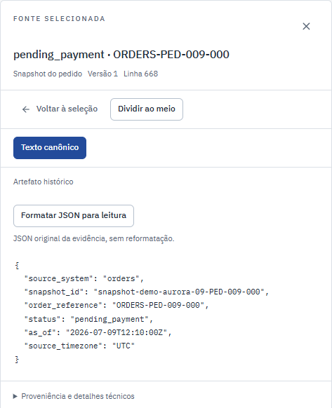

# Do pagamento pendente à revisão do dossiê

Preparei este roteiro para demonstrar uma investigação completa do **mesmo pedido**, sem geração por modelo. Pré-condição: seed carregado, API, worker e frontend prontos. Use apenas contas fictícias em um projeto local descartável. A aprovação por contas operadas pelo teste verifica o mecanismo, não equivale a julgamento semântico por uma pessoa.

## O que precisa ser conferido

O pedido `PED-009-000`, em `demo-aurora-09`, tem pagamento confirmado às **12:00:30 UTC de 09/07/2026**. O snapshot de pedidos das **12:10:00 UTC** ainda informa `pending_payment`: são 570 segundos depois. A política fictícia espera a transição em 300 segundos, até 12:05:30 UTC. A cobertura declarada inclui todo esse período, mas não há `order.payment_confirmed` no recorte.

O resultado esperado é **duas divergências sobre um pedido**, entre 222 pedidos do incidente. O dossiê deve citar o pagamento e o snapshot, registrar que a causa não foi estabelecida e deixar uma próxima verificação. Aprovar a revisão encerra a investigação na aplicação; **não muda esses registros nem comprova a correção do pedido**.

## Execução manual conferida em 22/09/2026

A jornada criou uma nova investigação pela API normal, usando a mesma coleção, janela e snapshot de `demo-aurora-09`. Isso permite repetir o roteiro sem reabrir artificialmente uma investigação já aprovada. O ID desta execução é `0f2e37db4fe44bc592fbb5944c5b449d`; o [registro funcional](evidence/editorial-payment-20260922/payment-story.json) conserva IDs de snapshot, fontes, dossiê, alegação, revisão e contas. Pagamento e estado do pedido não foram alterados para a captura.

[Captura completa da execução: divergências e pagamento original aberto](images/payment-story-20260922/01-pagamento-e-divergencias.png).


_O recorte focal acima foi recapturado na investigação de seed com o layout atual. A prova completa linkada conserva a identidade da execução original. O cabeçalho da aplicação apresenta Brasília; os campos do JSON usam UTC._



_Recorte nativo do leitor: `as_of` é o instante do snapshot, 570 segundos após o pagamento. Não é a hora do upload. [Página completa correspondente](images/payment-story-20260922/02-snapshot-pendente.png). Os dois arquivos originais foram baixados e seus hashes/tamanhos coincidiram com a proveniência declarada._

[Detalhe da revisão aprovada: alegação, duas fontes e limites explícitos](images/payment-story-20260922/05-dossie-detalhe-recorte.png).

_Recorte da revisão do mesmo caso: elaboração manual, decisão por Bruno e duas fontes vinculadas. A causa e a correção permanecem não demonstradas. [Original com a fonte aberta](images/payment-story-20260922/05-dossie-com-fonte.png) · [Limites do recorte da imagem](evidence/editorial-payment-20260922/crop.json)._

Ana recebeu 403 ao tentar aprovar; Bruno aprovou a versão indicada e preparou o HTML exportado. O teste conferiu as duas referências e a justificativa no arquivo. As duas divergências continuaram iguais depois disso. A [contagem no banco](evidence/editorial-payment-20260922/provider-check.json) permaneceu em zero chamadas ao provedor. A [captura móvel](images/payment-story-20260922/06-fonte-mobile.png) esperou a reautorização da fonte após a mudança de largura, em vez de registrar o carregamento.

Essas imagens mostram o produto real com dados sintéticos, sem troca de textos no DOM ou respostas simuladas. O [registro de navegador](evidence/editorial-payment-20260922/browser-review.json) identifica comando, versão do teste e hashes. Aprovar por automação com duas contas verifica permissões e rastreabilidade, não qualidade semântica humana. O [build](evidence/editorial-payment-20260922/runtime-build.json) e a [identidade do runtime](evidence/editorial-payment-20260922/runtime-identity.json) pertencem a esta execução; as capturas antigas continuam preservadas.

O caso de pagamento pendente é `demo-aurora-09`, também usado nas [capturas versionadas](publication-frontend.md). Na bancada, **Pedidos/Divergências no snapshot ativo** e a cobertura geral continuam descrevendo o snapshot ativo. Se escolher um snapshot anterior, o aviso explica que os registros abaixo seguem o recorte selecionado. Confira essa diferença antes de comparar contagens. O [guia de casos](problem-solution.md) explica os resultados esperados e aponta os testes, sem exigir que a apresentação provoque revogação, falha de worker ou exclusão de dados.

| Tempo     | Ação                                                            | O que observar                                                                                                                         |
| --------- | --------------------------------------------------------------- | -------------------------------------------------------------------------------------------------------------------------------------- |
| 0:00–0:40 | Entrar como Ana, abrir “Pagamento confirmado e pedido pendente” | Tenant, janela, snapshot, cobertura e divergências; não confundir data de ingestão com ocorrência.                                     |
| 0:40–1:30 | Selecionar um pedido e abrir fonte do pagamento e snapshot      | O evento confirma pagamento; snapshot posterior permanece incompatível. Clique na regra e confira localização da fonte.                |
| 1:30–2:20 | Ir à timeline e conferir cobertura                              | Ausência de transição significa não observada no recorte. Uma reentrega não prova cobrança duplicada.                                  |
| 2:20–3:15 | Criar/abrir dossiê manual, registrar hipótese citada e lacuna   | Uma alegação pode ser contestada; fatos, hipótese, contexto e contraevidência não são estados equivalentes. Edite e veja nova revisão. |
| 3:15–4:10 | Submeter; entrar como Bruno e comparar a revisão exata          | O autor não aprova a própria submissão; aprovação aponta IDs de alegações. Exporte somente depois de aprovar.                          |
| 4:10–5:00 | Exportar a versão aprovada e retornar às divergências           | O HTML conserva as fontes e a justificativa. Os dois registros operacionais continuam divergentes: aprovação não é remediação.         |

## Executar a jornada automatizada

A [jornada de pagamento](../frontend/e2e/payment-story.spec.ts) usa a interface e a API reais, sem substituir respostas ou texto no DOM. É opt-in porque cria uma investigação e um dossiê sobre as fontes do seed. Confere os horários contra valores esperados independentes, os IDs das duas fontes, a negativa à autora, a identidade do revisor, o HTML exportado e a preservação da conciliação após aprovar. As duas contas precisam estar disponíveis no seed.

Instale as dependências do [guia de desenvolvimento](development.md). Use um projeto novo; o perfil E2E desativa o provedor e esvazia a chave de Azure. Não reutilize o ambiente de uma apresentação com dados a preservar.

```powershell
$env:ED_BACKEND_IMAGE = 'pf-evidencedesk-backend:payment-story'
$env:ED_FRONTEND_IMAGE = 'pf-evidencedesk-frontend:payment-story'
python scripts/ops.py --project pf-evidencedesk-e2e-payment-story --e2e config
python scripts/ops.py --project pf-evidencedesk-e2e-payment-story --e2e build
python scripts/ops.py --project pf-evidencedesk-e2e-payment-story --e2e start
python scripts/ops.py --project pf-evidencedesk-e2e-payment-story --e2e seed
$env:ED_E2E_BASE_URL = 'http://127.0.0.1:3107'
$env:ED_PAYMENT_STORY = '1'
Push-Location frontend
npm run test:e2e -- payment-story.spec.ts
Pop-Location
python scripts/ops.py --project pf-evidencedesk-e2e-payment-story --e2e stop
```

Esse perfil publica exclusivamente em loopback, portas 3107/8107. Ele não inicia modelos nem observabilidade. A saída padrão fica em `frontend/artifacts/payment-story.json` e `frontend/artifacts/screenshots`; configure `ED_E2E_ARTIFACT_DIR` para uma pasta separada em cada rodada. O resumo não inclui cookies ou token de sessão. O relatório bruto e traces permanecem ignorados; revise a projeção pública antes de copiar artefatos para a documentação. `stop` preserva os volumes do projeto para inspeção.

Os testes que sustentam as decisões são separados da captura:

```powershell
# Após preparar PYTHONPATH e o PostgreSQL isolado em development.md:
.venv/Scripts/python.exe -m pytest backend/tests/unit/test_reconciliation.py -q
.venv/Scripts/python.exe -m pytest backend/tests/integration/test_manual_workflow.py::test_import_review_conflict_independent_approval_and_escaped_export backend/tests/integration/test_evidence_scope.py backend/tests/integration/test_administration.py::test_grant_revocation_hides_all_incident_surfaces_and_cancels_work -q
```

O teste de revisão independente usa um autor com capacidade de revisão para verificar a proibição específica de aprovar o próprio trabalho. Na jornada visual, Ana não possui esse papel e recebe 403; essa negativa sozinha não comprova a segunda regra.

## IA histórica e outros casos

Resultado real de IA **de outra execução histórica**: run `2605b0dcf3fd4045a345a51fd2f80bdf`, incidente `demo-aurora-01`, dossiê `35de4e41bc4f4a1c863ecbf665bf1505`. Pertence ao caso de reentrega, não ao pagamento pendente demonstrado acima. Há três alegações em rascunho e fontes do agregado determinístico. Outro checkout só possui esse resultado se restaurar os dados correspondentes; o seed não falsifica uma chamada Azure. A [jornada de reabertura](../frontend/e2e/existing-run.spec.ts) exige os IDs existentes e não admite uma nova geração.

Para mostrar revogação, use o ensaio isolado em `test_administration.py`; não revogue a coleção principal durante apresentação sem preparar a recuperação. Captura de erro controlado do frontend é fixture de transporte, identificada como tal, e não falha real do Azure.

Se um dado não estiver disponível, aponte a lacuna. A demonstração deve permitir conferir e discordar, não apenas admirar texto gerado.

## Provas para acompanhar a apresentação

A [sequência com capturas de 22/09](restore-read-story.md) mostra uma revisão aprovada com sua fonte, um conflito real 409 preservando rascunho e a leitura de incidente após restauração. Revisão/conflito aconteceram na origem antes do backup; restauração/exclusão têm run e destino próprios. A aprovação usou duas contas por automação, sem revisor humano nem geração por modelo. As imagens permitem conferir o mecanismo, enquanto o [pacote semântico](../evals/human-review/README.md) prepara a avaliação de qualidade ainda pendente.
