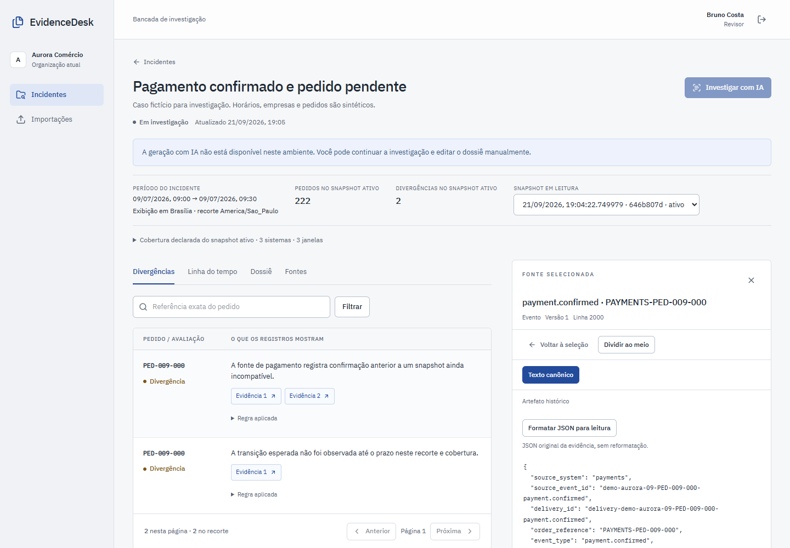
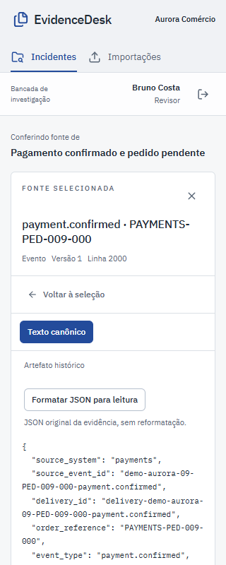

# Auditoria do frontend para publicação

Data: 21/09/2026. Escopo: bancada, importação, revisão, acessibilidade dos formulários e documentação do frontend. Consulte a [revisão da arquitetura](frontend-review.md) e o [guia de execução](../frontend/README.md).

## Problemas corrigidos

- **Coleções após o limite inicial:** a API e os dois formulários só alcançavam as primeiras cem coleções. A API agora fornece cursor, e incidente/importação compartilham um seletor com “Carregar mais coleções”, erro recuperável e estado vazio.
- **Alterações durante gravação:** era possível continuar editando campos enquanto o servidor recebia a versão anterior. Incidente, investigação, dossiê e decisão bloqueiam seus controles durante a requisição para não descartar alterações silenciosamente.
- **Limites divergentes:** a justificativa aceitava quatro mil caracteres onde a API aceita três mil. Alegações também careciam de validação local dos limites de fontes, pedidos e notas. Os limites foram alinhados e recebem mensagens em português. Um resultado com evidências exige alegações citadas antes do envio.
- **Trabalho de revisão não salvo:** fechar a decisão descartava a justificativa sem aviso. A interface agora confirma o descarte e protege recarregamentos quando há alterações.
- **Erros dos formulários:** campos de criação, resumo, resultado, alegação e pergunta de investigação agora expõem estado inválido e descrição associada ao erro; a navegação principal informa a página atual.
- **Mensagem de IA indisponível:** detalhes de configuração do servidor foram substituídos por uma orientação ao investigador: continuar a investigação e editar o dossiê manualmente.
- **Documentação que dependia de arquivos ignorados:** a revisão antiga apontava relatórios e imagens locais ausentes em um clone novo. A revisão atual aponta código, comandos reproduzíveis e imagens selecionadas para versionamento.

## Evidência desta revisão

`npm run typecheck`, `npm run lint`, `npm run format:check` e `npm run test` passaram após as mudanças. Resultado dos unitários: **61 testes em 10 arquivos**, incluindo oito regressões novas para limites de alegações e resultado sem fontes.

A regressão `publication-regressions.spec.ts` foi adicionada para seleção de coleções após cem itens, descrição acessível de erros e gravação de incidente/dossiê com resposta atrasada. A jornada de revisão existente também verifica o máximo de três mil caracteres e a preservação da justificativa após recusar o descarte.

A rodada completa de Playwright começou em **21/09/2026 às 22:11:12 UTC** contra as imagens de produção no projeto Compose isolado: **11 passaram em 38,6 s**, **1 ignorado explicitamente**, zero falhas e zero retries. O teste opcional ignorado exige IDs de uma geração Azure existente; o laboratório desativa o provedor pago. A identificação das imagens, o resultado de cada caso e as contagens estão no [resumo estruturado](evidence/publication-frontend.json).

Foram exercitados login e troca de organização, divergências e fontes, revalidação da sessão e revogação controlada, dossiê manual, conflito real entre revisões, segundo revisor, exportação, importação e renderização PDF reais, teclado, regras axe e larguras 320/768/1440 px. A nova regressão de paginação e gravação lenta também passou. O teste PDF confirmou pixels renderizados e o SHA-256 do original.

A inspeção adicional pelo navegador in-app usou a conta sintética Bruno: fila, abertura do incidente, título e conteúdo da fonte, foco no leitor e apresentação da bancada. Não foram criadas novas investigações de IA.

Depois da última alteração, restrita ao texto de IA indisponível na API, a mensagem foi conferida novamente pelo navegador in-app. A jornada visual foi repetida às **22:17:22 UTC**: **1 passou em 7,3 s**, sem skip, falha ou retry, usando a mesma imagem frontend e a API atualizada. O resumo estruturado preserva as identidades de ambas as execuções; a rodada completa não é atribuída à imagem posterior.

## Imagens versionadas

As capturas usam dados sintéticos da execução real. O leitor móvel mantém o nome do incidente, a navegação e o texto original; a tabela da bancada usa rolagem própria em telas estreitas.

Os relatórios brutos e traces temporários permanecem ignorados pelo Git. O resumo acima contém somente campos de teste selecionados, sem caminhos pessoais, cookies ou credenciais.
