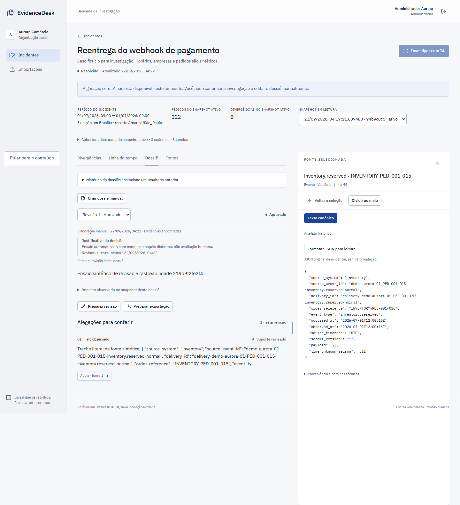
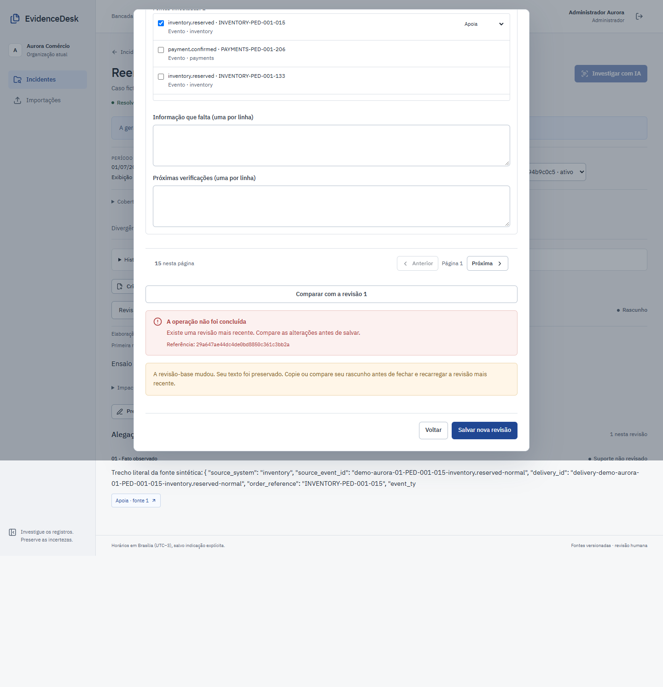
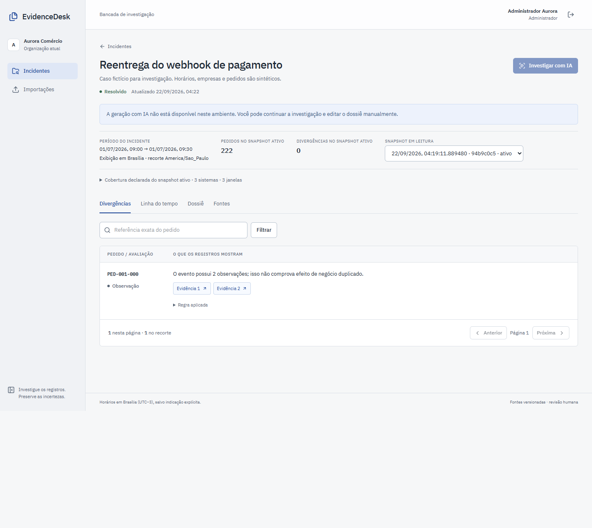
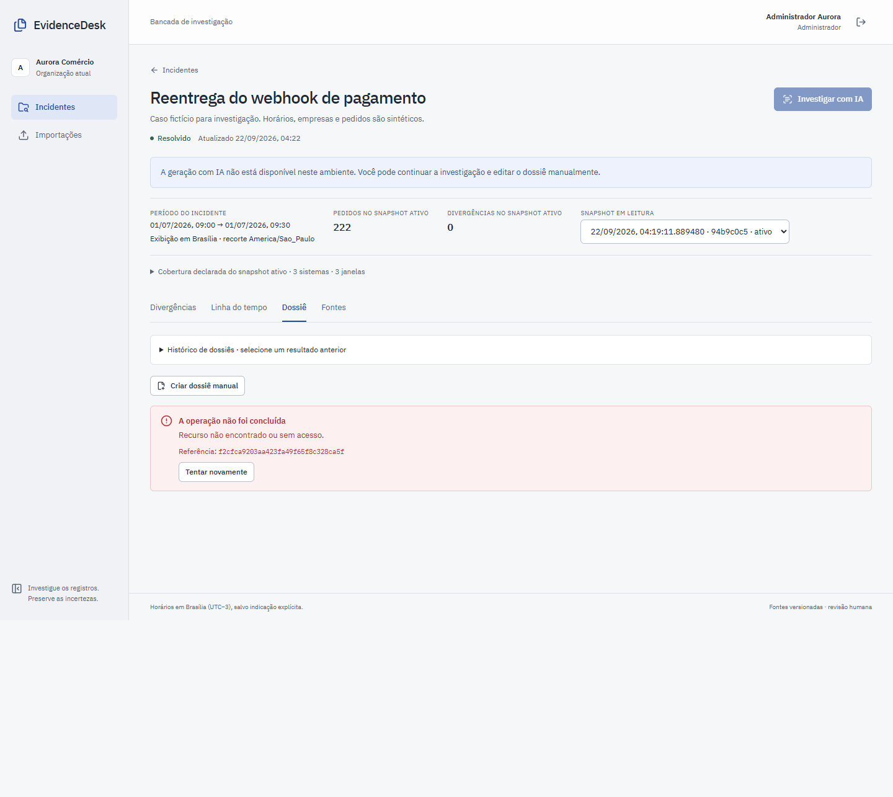
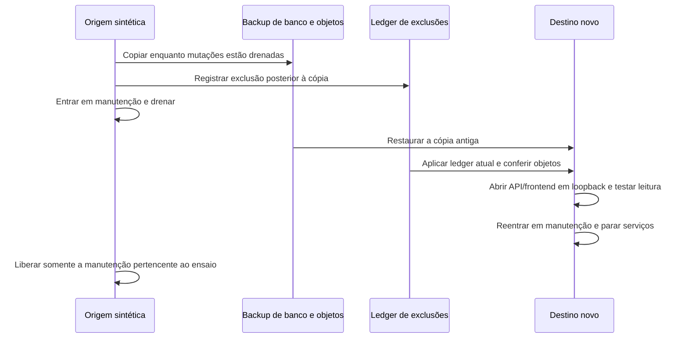

# Reabrir a investigação sem recuperar o que foi excluído

Um backup antigo pode conter uma fonte apagada depois. Recuperar os bytes sem reaplicar a exclusão permitiria reabrir um material que deveria continuar inacessível. O EvidenceDesk separa banco/objetos do registro de exclusões e confere esse registro atual antes de abrir o destino.

**Resultado local de 22/09/2026:** o destino restaurado abriu um incidente preservado no navegador e recusou a fonte excluída, seu original e o dossiê dependente com HTTP 404. O ledger avançou de 0 para 1 e foram verificadas **108 referências remanescentes**. Houve zero chamadas ao provedor. O [manifesto da rodada](evidence/restore-read-story/20260922T072246Z-492911fe/manifest.json) relaciona fontes, imagens, fases, testes e capturas.

## Três situações, com provas distintas

| Situação | O que foi observado | Consequência para quem investiga |
| --- | --- | --- |
| Dossiê aprovado com fonte | Revisão aprovada, fonte real aberta e texto canônico igual ao retornado pela API | A conclusão pode ser rastreada até o material usado |
| Edição concorrente | Uma segunda revisão foi gravada; salvar a base antiga retornou `409 revision_conflict`, mantendo o rascunho no editor | O trabalho de outra pessoa não é sobrescrito silenciosamente |
| Restauração após exclusão | Incidente sobrevivente legível, fonte/original/dossiê excluídos inacessíveis; objeto ausente e referências removidas | Recuperar a aplicação não ressuscita esse material excluído |

Os dois primeiros casos ocorreram na origem, **antes do backup**, com run de revisão `319b9f2fe2f4`. O terceiro pertence ao run de exclusão/restauração `a468f70ee9bb`, em outro projeto. O conflito de edição não é apresentado como causa da restauração.

O dossiê foi criado pela API com trecho literal de fonte sintética e aprovado por outra conta da aplicação. Isso verifica separação de papéis e rastreabilidade. **Não foi uma avaliação humana da conclusão**, nem geração por IA; a própria justificativa da aprovação identifica a automação.

## Capturas autênticas

Navegador Microsoft Edge 153.0.4234.48, Playwright 1.63.0, páginas reais e dados sintéticos. Os IDs de dossiê, revisão, fonte e snapshot estão nas provas do manifesto. As capturas não receberam substituição de texto no DOM para simular um resultado.



*Revisão aprovada por conta distinta, com fonte e texto canônico abertos. A aprovação automatizada não equivale ao julgamento humano preparado no pacote de avaliação.*



*O servidor recusou a base desatualizada com 409. A jornada também conferiu o texto mantido no campo; a imagem mostra a mensagem e o editor aberto.*



*O incidente `demo-aurora-01` preserva o recorte e explica que duas observações do evento não comprovam pagamento duplicado. Geração por IA está desativada.*



*O acesso direto ao dossiê excluído falhou no destino reaberto. O mesmo ensaio conferiu HTTP 404 da fonte e do arquivo original, além de sua ausência no armazenamento.*

O manifesto inclui mais duas capturas: revisão aprovada sem leitor e erro da fonte excluída. A captura longa da lista de fontes precisa ser aberta no tamanho original para conferir seus detalhes.

## Por que abrir dentro da janela de recuperação

O [restore padrão](runbooks/backup-restore.md) continua fechado. A extensão [restore_read_probe.py](../scripts/restore_read_probe.py) só abre uma jornada opcional depois da reconciliação do ledger atual e da verificação dos objetos, enquanto a origem ainda está na manutenção adquirida pelo executor. Abrir a partir de um relatório salvo, depois de liberar a origem, poderia usar um ledger já ultrapassado por outra exclusão.



No destino, só banco, API e frontend ficaram ativos. As imagens de API/frontend foram identificadas por SHA-256 e associadas às fontes do build; o binding efetivo foi conferido em `127.0.0.1`. Worker, modelos e geração externa permaneceram ausentes/desativados. Uma sessão nova do navegador evitou reutilizar cookies de outra porta no mesmo host.

A jornada permitiu login e leituras e verificou ausência de chamadas de geração. **A API aberta não é um serviço imposto como somente leitura**: após sair da manutenção ela conserva as mutações normais do produto. O isolamento da prova, o percurso restrito e as comparações de estado sustentam a afirmação sobre esta jornada, não uma nova política de acesso da aplicação.

Foram comparados hashes por linha de **17 tabelas de domínio**, além de linhas/contagem de `provider_calls` e checkpoint do ledger, antes/depois da leitura. As tabelas estão enumeradas na evidência. Sessões, limites de login, auditoria e controle operacional ficam fora dessa igualdade porque login/manutenção produzem alterações legítimas. Não é comparação integral do banco, nem afirmação de que importar e excluir deixaram a origem inteira inalterada.

## Resultado físico e duração

A origem foi `pf-evidencedesk-capacity-edread-492911fe`; o destino, `pf-evidencedesk-restore-edread-492911fe-r2`. A exclusão posterior ao backup avançou o ledger e concluiu o purge. O restore reaplicou um registro de exclusão, esvaziou o conteúdo de uma evidência e verificou 108 referências restantes. A inspeção posterior confirmou tombstone, texto canônico e alegações apagados, objeto original ausente e nenhuma referência à chave excluída.

| Fase desta tentativa | Tempo observado |
| --- | ---: |
| Preparar os dois casos de revisão | 2,696 s |
| Duas jornadas de aprovação/fonte e conflito | 9,340 s |
| Helper completo de exclusão, backup, restore e verificações | 86,072 s |
| Operação de restore, incluindo reabertura/leitura e fechamento | 63,305 s |
| Janela opcional de reabertura/leitura/fechamento | 37,099 s |

As duas últimas linhas estão contidas nas anteriores; não devem ser somadas como fases independentes. Esta tentativa reutilizou a origem sintética preparada anteriormente. Build e seed não estão incluídos nesses tempos. É uma execução local, não estimativa de RTO comercial, recuperação entre hosts ou teste de capacidade. Os objetivos de RPO/RTO do runbook continuam separados destas observações.

Os containers dos projetos foram parados ao final e a ausência de containers ativos foi conferida. **Volumes foram preservados para inspeção**, conforme o contrato do helper existente; não foram removidos nem houve prune global. Manifests completos do backup, tokens, ambiente e saídas privadas ficam fora do repositório/OneDrive. A projeção pública identifica hashes e dados sintéticos sem publicar esses segredos.

## Reprodução e dificuldades

Para uma nova rodada isolada, instale as dependências operacionais e de teste de `backend/requirements-test.lock`, execute `npm ci` em `frontend/` e prepare o navegador Playwright. Na raiz do repositório, use um diretório novo fora do repo e do OneDrive:

```powershell
python scripts/prove_restore_read.py --artifacts D:/private-evidence/ed-restore-new-run --browser-channel msedge
```

O [executor público](../scripts/prove_restore_read.py) cria a associação entre fontes e imagens a partir do build, prepara dados sintéticos, executa as revisões e chama a prova de restauração. Ele foi acrescentado **depois da rodada registrada**: seus controles passaram nos testes host, mas o comando completo ainda não foi executado. Os comandos efetivamente usados na rodada estão no manifesto. O conjunto host atual executou 54 casos: 53 passaram e um teste de links simbólicos foi ignorado no Windows; as três jornadas Playwright são verificações separadas.

O ponto de entrada é [check_erasure_restore.py](../scripts/check_erasure_restore.py), com `--reopen-read`, `--runtime-proof` e `--read-artifacts`, sobre uma origem sintética no namespace de capacidade. O [preparador das revisões](../scripts/prepare_review_capture.py) e a [jornada de navegador](../frontend/e2e/restore-read.spec.ts) tratam os dois casos anteriores ao backup. O manifesto da rodada registra a preparação e os parâmetros; as [instruções de backup](runbooks/backup-restore.md) explicam os diretórios privados, ownership e fechamento. Associação de fonte/imagem precisa vir de build conferido; não basta escrever um digest em um JSON para tornar a prova válida.

Há uma lacuna de reprodução delimitada: os arquivos de `datasets/generated` e `infra/init.sql`, montados na preparação, não tiveram hashes congelados antes e depois daquela execução. O inventário posterior identifica os arquivos encontrados, sem provar retroativamente sua identidade durante o seed. A prova de recuperação continua apoiada nos hashes dos objetos do backup, snapshots e comparações de domínio. O novo executor registra também essas entradas nas próximas rodadas. O ajuste posterior de diagnóstico para saídas de processo em texto ou bytes e o novo executor estão separados das fontes efetivamente executadas no registro de associação.

A primeira preparação falhou por usar `id` onde o contrato da alegação expõe `claim_id`. Foi corrigida contra o contrato real; os artefatos da tentativa falhada foram preservados. A tentativa aprovada usa novos casos, nova saída de evidência e novo destino, reaproveitando somente a origem sintética identificada.

A revisão do executor também tratou fechamento de destino em falha antecipada, limite da árvore do processo de navegador e digest por linha para evitar agregar o texto inteiro do corpus. Essas mudanças protegem a prova e a operação local. Os testes host e eventuais ajustes de diagnóstico posteriores têm seus próprios registros no manifesto; não são outra execução no banco nem repetição da suíte completa do produto.

## O que isso permite avaliar — e o que falta

Para uma revisão técnica, agora é possível seguir o problema, a ordem dos controles, a recusa e a leitura real após recuperação. Uma tela de sucesso ou um dump existente, sozinhos, não forneceriam essa evidência. O caso usa uma fonte e um dossiê dependente; os testes de duplicatas, ledger divergente e unlink parcial têm evidências próprias e não são apresentados como parte desta mesma execução física.

Permanecem pendentes cópia/destino fora do computador e julgamento semântico por pessoas. O [pacote de revisão](../evals/human-review/README.md) prepara 60 casos de desenvolvimento, referências e rubrica, mas não contém respostas julgadas. A busca lexical/manual segue como referência; o candidato de modelo não foi promovido. Abertura local verificada e aprovação por conta distinta não substituem essas validações.
