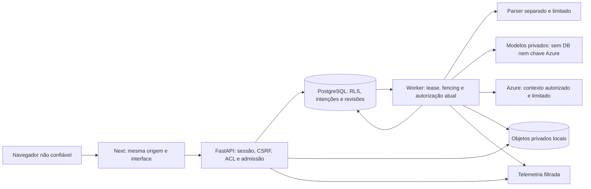

# Ameaças e limites de confiança

Escopo: laboratório local com dois tenants, dados sintéticos, papéis distintos e inferência Azure. Não é auditoria de segurança profissional nem certificação de imunidade a prompt injection.

## Fronteiras

O proxy Next não é autoridade de negócio. Cookie, cursor, snapshot, ID de evidência e pedido do modelo nunca concedem permissão por si. O tenant deriva da sessão/ExecutionContext, não do corpo enviado pelo navegador ou da instrução recuperada.

## Ameaças e controles verificáveis

| Ameaça | Controle concreto | Evidência e limite |
| --- | --- | --- |
| Acessar outro tenant por ID conhecido | ACL de coleção/incidente, RLS transaction-local e FKs compostas; role sem owner/BYPASSRLS | Integrações manual/retrieval/admin. RLS não protege uma credencial owner comprometida. |
| Reutilizar conteúdo depois de revogação | Revisão de política, reautorização de fonte/derivados, cache por contexto, 404 antienumeração | Testes de revogação e seleção de últimos IDs. Bytes já entregues ao usuário não podem ser recolhidos. |
| CSRF e sessão roubada | Sessão opaca/hash, Origin, token CSRF, expiração/logout, cookie HTTP-only | HTTP local usa cookie sem Secure por loopback; perfil TLS exige Secure. Não há SSO/MFA demonstrado. |
| Força bruta concorrente | Reserva atômica antes do hash/verificação da senha | 10 de 16 tentativas concorrentes chegaram à verificação; seis receberam429. Sucessos também contam. |
| DoS de corpo/upload/SSE | Limites reais de bytes/prazo, slots de upload, quota temporária, limite SSE compartilhado e buffer bounded | Corpo não confia em Content-Length; testes de stream/admissão/upload concorrente. Limites locais não são WAF. |
| Parser malicioso | Manifesto sem ZIP/URL, hash, subprocesso, prazo, limites Linux e bloqueio de rede/subprocessos pelo audit hook | Não equivale a sandbox seccomp contra comprometimento do interpretador/kernel; OCR não ativado. |
| Prompt injection em fonte | Ferramentas tipadas, identidade do servidor, ausência de SQL/URL/comando, contexto limitado e referências validadas | Fonte permanece dado não confiável. O modelo ainda pode escrever uma alegação sem suporte: revisão/evals tratam esse risco. |
| Recuperação amplia corpus | Filtro autorizado antes de lexical/vetor, snapshot fixo, vigência explícita, reranking somente de textos já recuperados | Testes PostgreSQL reais; modelos não recebem DB/segredo Azure. |
| Resposta com fonte inventada | Schema fechado, IDs/versões autorizados, pedidos do recorte, números de impacto calculados no domínio | Existência da citação é condição necessária, não prova semântica. Texto livre não recebe certificado automático de verdade. |
| Worker atrasado publica | Lease, fencing monotônico, deadline/cancelamento/ACL na transação final | Dois processos concorrem pela mesma fila; tentativa antiga não conclui depois da substituta. |
| Chamada externa duplicada | Retry único e classificado; tentativa expirada após dispatch/uso reportado falha sem repetir inferência | Não há promessa de exatamente uma cobrança externa. Unknown retém reserva inclusive após virar o mês. |
| Excluir e restaurar conteúdo indevidamente | Tombstone imediato, cópias/derivados, fila de purge, ledger independente e restore fechado até replay | Exclusão+restore testados. Ledger e banco não formam uma transação distribuída; falha exige protocolo de manutenção. |
| Quota liberada duas vezes | Ownership por entrada, CAS em quota_released_at, fila de limpeza persistida | Replay, retenção e purge compartilham a liberação; falha física preserva fila e reserva. |
| Exfiltração em logs/traces | Allowlist de campos/atributos e cabeçalhos; sem corpo/prompt/chave/email, cardinalidade controlada | Exportadores locais testados. Azure Monitor hospedado não está validado. |
| Arquivo original executa HTML/JS | Leitor canônico, PDF lazy, CSP/sandbox/nosniff, export escapado e aprovado | Original é servido por rota autorizada; não há link público permanente. |

## Segredos e egress

A chave Azure reside no runtime do backend; no host Windows há cópia DPAPI fora do Git/OneDrive. Administradores do host/daemon conseguem inspecionar o ambiente de containers: isso não é isolamento contra o dono da máquina. Não transportar `docker inspect` completo para evidências.

O endpoint de geração é allowlist HTTPS explícita. O serviço ML usa host interno fixo, token próprio, `trust_env=False` e não baixa pesos implicitamente. O armazenamento Blob preparado aceita nome de conta validado e Managed Identity, sem SAS público; não está conectado ao ciclo local de GC/ledger.

## Pendências antes de exposição pública

Não expor os defaults de demonstração. O perfil hospedado requer identidade corporativa/TLS, revisão da rede/egress, rotação e RBAC, validação do armazenamento compartilhado e recuperação de desastre fora do host. Upload/limpeza remoto precisam de quarentena durável de I/O para preservar quota e fencing sem segurar conexão de banco durante rede. Não substituir isso por um mount no disco efêmero do container.
